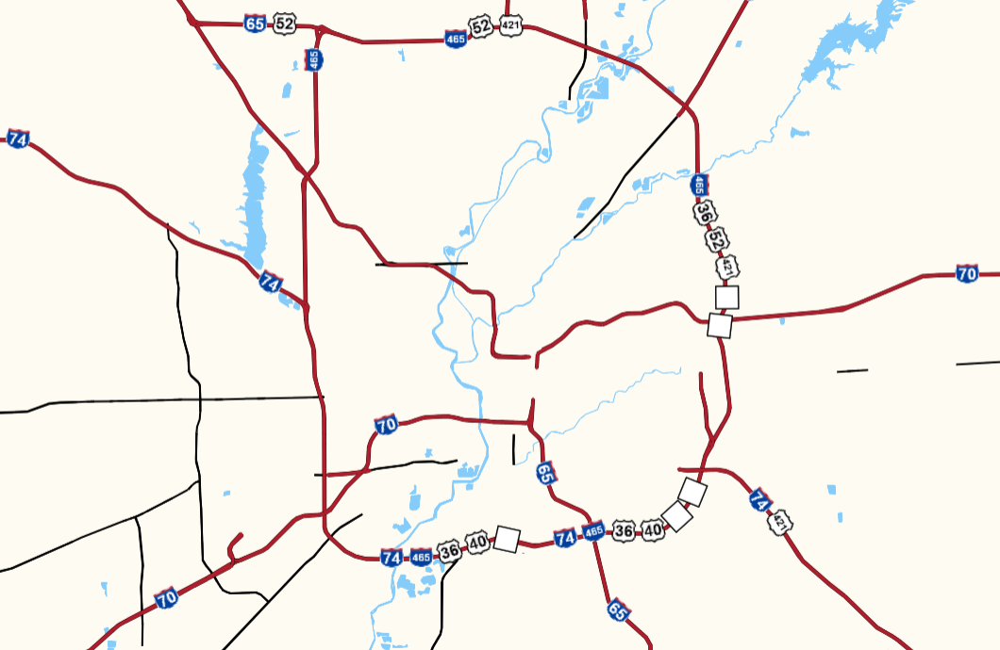

# maplibre-shield-rotation-sample

This is a sample application intended to demonstrate a technique for highway shield rendering.

Usage:

`make run`

In a web browser, open: [http://localhost:1776/#10/39.8087/-86.0879](http://localhost:1776/#10/39.8087/-86.0879)

This will load a customized OpenMapTiles .mbtiles files configured for highway shields, which customized highway shield rendering for highway concurrencies, with data populated for the US state of Indiana.

## Sample rendering

